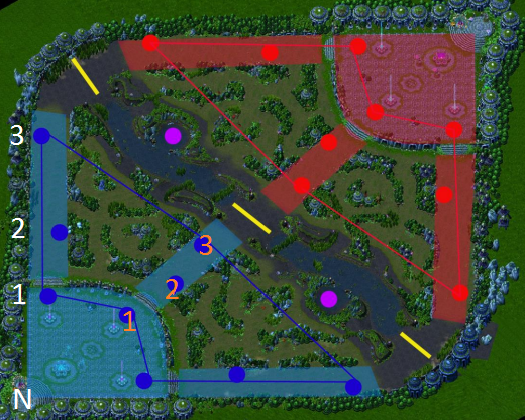

# Overview
League of Legends is a popular multiplayer online battle arena (MOBA) video game. Two teams of five players control characters called "champions" and compete to complete objectives. Teams begin the game on opposite corners of a sizeable map. To win the game, they must destroy a sequence of enemy turrets, invade the enemy base, and destroy the enemy nexus.

During the game, players engage in complex strategic actions to increase the strength of their champions, accomplish objectives, and eliminate players on the enemy team. Games tend to last between 30-45 minutes, although some may be much shorter or longer. League of Legends has over 100 million unique monthly players, and billions of League of Legends games have been played. Each game generates a tremendous amount of data, which is archived and made available by Riot (the company behind League of Legends) to enable players to track the progress of themselves and their friends. 

I propose to use neural networks to predict the outcome of a League of Legends match based upon player performance in prior games. Due to the tremendous amount of data available, I anticipate that a network trained on a sufficiently large dataset can achieve a high accuracy at this prediction task.
